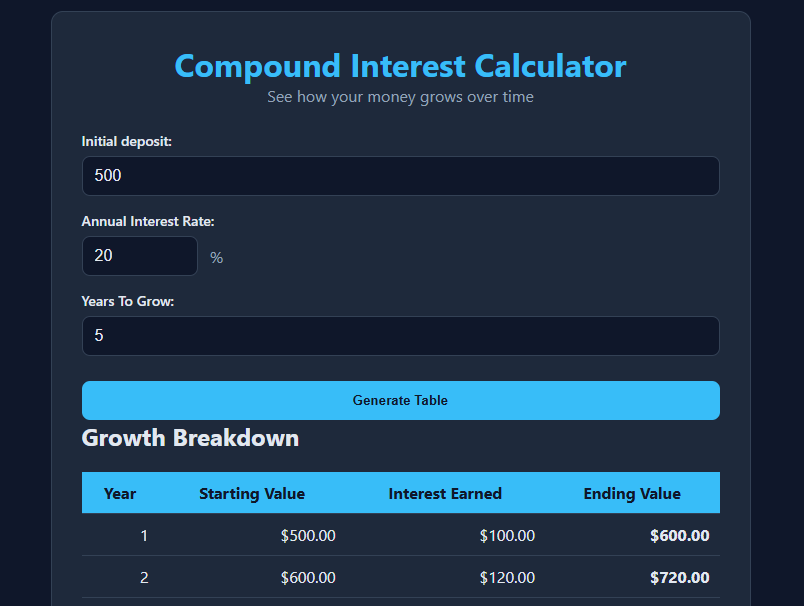

# Compound Interest Calculator

A Responsive web app that calculates compound interest growth year-by-year using a "for loop". It validates user input and visualizes growth with an interactive Chart.js line graph.
Built as part of my Front-End Developer portfolio to demonstrate DOM manipulation, form validation, and data visualization

## Feartures
- User inputs: Initial deposit, Annual interest rate, Years
- Dynamic table showing Starting Value, Interest Earned, Ending Value for each year
- Currency formatting using Intl.NumberFormat
- Data Visualization: Interactive line chart to show account growth
- Clean UI: Dark theme with accessible form
- Mobile responsive design
- Reset functionality

## Tech Stack
- HTML5 - Semantic structure
- CSS3 - Custom properties, responsive layout
- Vanilla JavaScript ES6+ - DOM manipulation, event listeners, for loop
- Chart.js: CDN for data visualization

## How to Use
1. Enter Initial Deposit amount
2. Enter Annual Interest Rate %
3. Enter Number of Years
4. Click "Generate Table" to see the breakdown

## Concept Practiced(learned)
- DOM manipulation with 'querySelector' and 'insertAdjacentHTML'
- Using 'for loop' for interative calculations
- Seperating concerns with 'addEventListener' instead of inline JS
- Handling user input errors with custom JS instead of browser defaults
- Chart.js Integration, fetching data from JS arrays and rendering a responsive line chart
- Formatting currency with 'Intl.NumberFormat'

## Screenshot

## Future Improvements
- Add toggle for "Simple Interest vs Compound Interest" on the chart
- Export table to CSV
- Add currency selsctor

## Author

**William Adejoh**
Frontend Developer
---
&copy; 2026 Compound Interest Calculator. Part of web development portfolio.