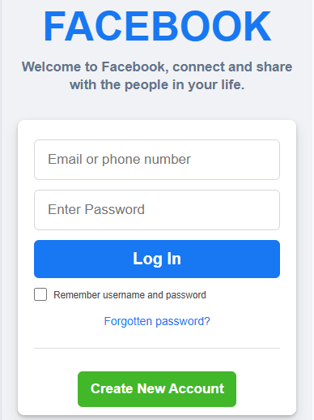

# Facebook Login  Page Clone

A responsive UI clone of the Facebook login and sign-up page. Focused on replicating the layout and styling.

## Features

- Two-Column Layout: Brand info on left, login form on right for desktop
- Responsive: Stacks to single column on mobile
- Form Styling: Inputs, buttons, and links styled to match Facebook
- Hover/Focus States: Interactive feedback on buttons and link
- No JavaScript: Pure HTML and CSS implementation

## Tech Stack

HTML5, CSS3

## How to Run
1. Clone the Repo
2. Open `index.html` in your browser
3. Resize window to see responsive behavior

## Concept Practiced(learned)
- CSS Flex box for centering and layout
- Media queries for responsive breakpoints
- Box-shadow and border-radius for card design
- CSS variables for consistent colors
- Attention to detail in UI/UX replication

## Note

This is a UI clone for learning purposes only. No backend functionality.

## Screenshot

## Future Improvements
- Add form validation with JavaScript
- Add a toggle for dark mode
- Animate the form on page load

## Author

**William Adejoh**
Frontend Developer
---
&copy; 2026 FacebookClone(login & sign-up page). All rights reserved.