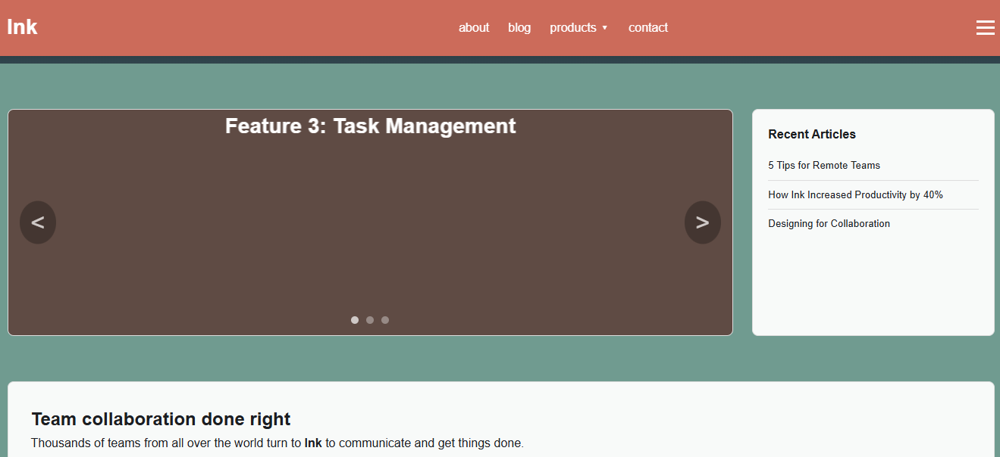

# Ink - Team Collaboration Landing Page
A clean, responsive, single-page landing template for team collaboration tools.
Built with pure HTML5 and CSS3. No frameworks, No JS.

## Features
- Fully Responsive: Mobile-first design. Works on mobile, tablet, and desktop.
- CSS-Only Auto Carousel: Smooth 3-slide auto animation. No JavaScript needed.
- Sticky Header: With dropdown navigation menu.
- Modern UI: CSS Variables, Flexbox, and Grid layout.
- Clean Code: Grouped selectors, comments, and production-ready structure

## Screenshot

*Desktop View*

*Mobile View*

## Tech Stack 
- HTML5 - Semantic structure
- CSS3 - Variables, Flex, Grid, Animation, Media Queries
- Google Fonts - Playfair Display

## How to Run 
Just open 'index.html' in your browser. No install needed.

## Author

**William Adejoh**
Frontend Developer

---
&copy; 2026 Ink. All rights reserved.