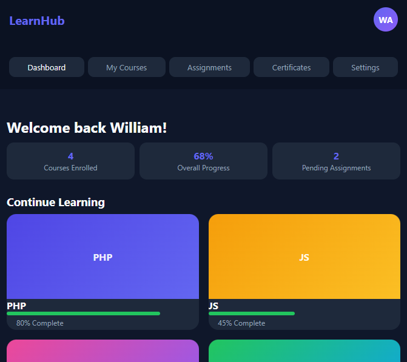

# LearnHub - Learning Management System UI

A modern, responsive Learning Management System dashboard built with HTML5, CSS3, and Vanilla JavaScript. 
This project showcases UI/UX design for online learning platforms with course tracking and progress visualization.

## Features
- Student Dashboard: Welcome header with quick stats overview
- Course Cards: Grid layout of enrolled courses with cover images
- Progress Tracking: Visual progress bars for each course
- Responsive Sidebar: Navigation for Dashboard, Courses, Assignments, and Settings
- Mobile Friendly: Collapsible sidebar layout for tablets and phones
- Dark Theme: Modern dark UI with accent colors and smooth hover effects
- No Dependencies: Built with 100% Vanilla JS for easy deployment

## Tech Stack
- HTML5: Semantic layout and structure
- CSS3: Flexbox, CSS Grid, CSS Variables, Media Queries
- JavaScript ES6+: Dynamic course rendering and DOM manipulation

## How to Run
1. Clone or download this repository
2. Open `index.html` in your browser
   No build tools or server required

## What I Learned
- Building responsive dashboard layouts with CSS Grid and Flexbox
- Managing and rendering data with JavaScript arrays and template literals
- Creating reusable UI components like stat cards and course cards
- Designing for both desktop and mobile experiences

## Screenshot

## Future Improvements
- Connect to PHP + MySQL backend for real user data
- Add course detail page with video player and lesson list
- Implement authentication, quizzes, and certificate generation
- Add search and filter for courses

---
Built by **William Adejoh** as part of my web development portfolio.