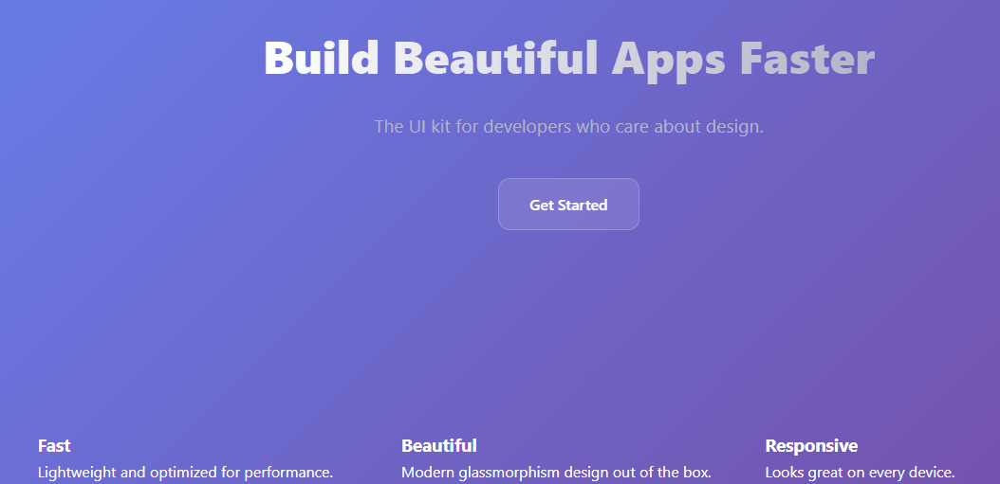

# SaaS Product Landing Page 

A modern, responsive landing page designed for a fictional SaaS product. Built to practice layout and conversion-focused design.

## Features

- Clean hero section with clear CTA
- Feature grid with icons
- Fully responsive on mobile, tablet, and desktop

## Tech Stack
HTML5, CSS3

## How to Run
1. Clone the repo
2. Open `index.html` in your browser

## Concept Practiced(learned)
- CSS Flexbox and Grid for complex layouts
- Responsive design with media queries
- CSS transitions and hover effects
- Mobile-first workflow

## Screenshot

---
Built by **William Adejoh** as part of my web development portfolio.