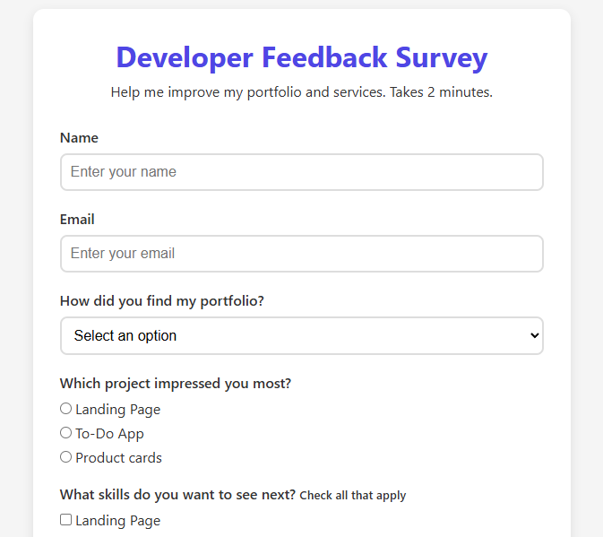

# Survey Form

An accessible feedback form built with semantic HTML and CSS.
Includes basic JavaScript validation for required fields and email format.

## Features
- Responsive Layout: Works on mobile and desktop
- Form Elements: Text, Email, Number, Dropdown, Radio, Checkbox, Textarea
- Client-side Validation: Ensures required fields are filled before submitting
- Accessible: Proper labels for screen readers
- Clean UI: Focus states and hover effect for better UX

## Tech Stack
- HTML5
- CSS3
- Vanilla JavaScript

## How to Run
1. Clone the repo
1. Open 'index.html' in your browser.
2. Fill out form and click "Submit Feedback".

## Concept Practiced
- Semantic HTML: `form`, `label`, `input`
- CSS Flexbox and Grid for layout
- Form validation and user experience
- Responsive design principles
- Accessibility best practices

## Screenshot

## Future Improvements
- Connect to a backend to submit data
- Add success/error messages after submit
- Multi-step form version

Built by **William Adejoh** as part of my web development portfolio.