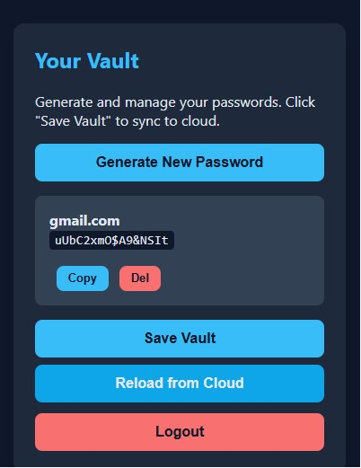

# VaultJS - Zero-Knowledge Browser Password Manager

A simple password manager where your data is encrypted in the browser before it ever touches
the server. The server only stores encrypted blobs.

**Live Path**: `http://localhost/wp-portfolio/projects/VaultJS-Browser-Password-Manager/`

## Features
- Zero-Knowledge: Master password + salt -> AES 256-GCM key. Never leaves your device
- End-to-End Encryptes: Vault is encrypted in browser before being sent to PHP/MySQL
- Generate & Manage: Create 16-char secure passwords, copy, delete
- Cloud Sync: Save to server and reload from any device
- Dark Theme + Responsive: Works on desktop, tablet, and mobile

## Demo Flow
1. Register -> Server gives you a random salt
2. Login -> Browser derives encryption key(AES with PBKDF2) from your password + salt
3. Generate/Save -> Vault is encrypted with AES-256-GCM and saved to MySQL
4. Reload -> Pull encrypted vault from server and decrypt locally

## Tech Stack
- Frontend: HTML5, CSS3, Vanilla JavaScript, Web Crypto API
- Backend: PHP 8+, PDO, MySQL
- Cypto: PBKDF2-SHA256 100K iterations + AES-GCM

## How to Run
1. Clone and move to htdocs
2. Create Database: import `database.sql` in phpMyAdmin
3. Configure DB: Update username/password in `register.php`, `login.php`, `save.php`, and `load.php` if not using root with no password
4. Run: start Apache + MySQL in XAMPP. 

## Concept Practiced/Learned
- Client-Side Cryptography: Using `crypto.subtle` for key derivation and encryption
- Zero-Knowledge Architecture: Server never sees plaintext or master password
- Base64 + ArrayBuffer handling: Converting binary data to/from JSON for API calls 
- PDO + Prepare Statements: Secure PHP to MySQL communication
- State Management in Vanilla JS: Managing vault object in memory and syncing to cloud
- Responsive UI + Dark Theme: CSS variables and mobile-first layout

## Security Note
If you forget your master password, the vault cannot be recovered. There is no "reset password"
because the server doesn't have your key.

## Screenshot

## Future Improvements
- Password Strength Meter: Show entropy score when generating passwords
- Categories/Tags: Organize passwords by "Work", "Social", "Bank"
- Search & Filter: Instant search through vault entries
- Import/Export: Encrypt JSON backup file
- 2FA: Add TOTP support for login
- Deploy with HTTPS: Required for clipboard API and security in production

Built by **William Adejoh** as part of my web development portfolio.